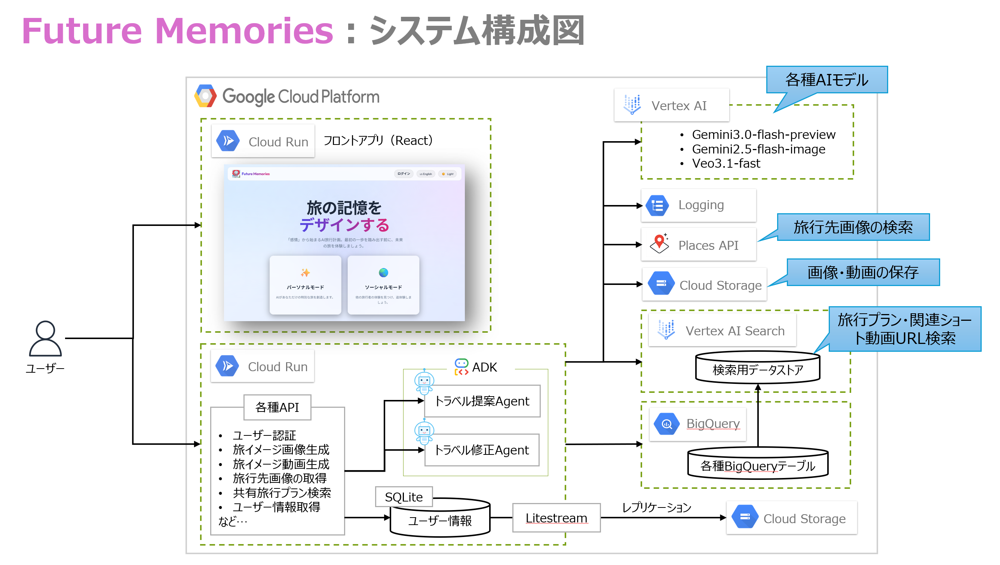
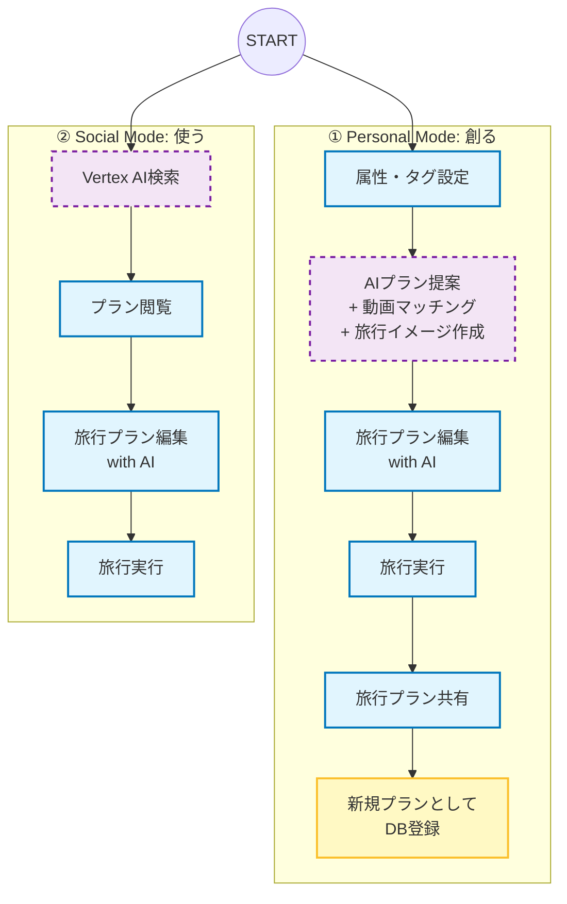

# Future Memories - 旅の思い出循環プラットフォーム

**第4回 Agentic AI Hackathon with Google Cloud 提出プロジェクト**

## 目次

1.  [プロジェクト概要](#プロジェクト概要)
2.  [主な機能](#主な機能)
3.  [アーキテクチャ](#アーキテクチャ)
4.  [ユーザー体験フロー](#ユーザー体験フロー)
5.  [システム構成](#システム構成)
6.  [プロジェクト構成](#プロジェクト構成)
7.  [セットアップと実行](#セットアップと実行)

## 1. プロジェクト概要

「Future Memories」は、AIがユーザーの潜在的な願望を形にする「パーソナルモード」と、他者の良質な体験を再利用する「ソーシャルモード」を融合させた、次世代の旅行体験プラットフォームです。

従来の「プラン作成」にとどまらず、旅の計画から実行、そして **「思い出（レポート）」が次の誰かの「未来の旅」としてデータベースに還流するエコシステム** を構築します。

本プロジェクトのコアコンセプトは **"Designing Future Memories"** —— 「情報」ではなく「感情」で旅先を選ぶ新しい体験を提供することです。

## 2. 主な機能

### 1. Personal Mode (創る：あなただけの思い出を)
- **AIプラン提案**: 「のんびりシニア」「わんぱくファミリー」「女子旅」などのユーザー属性やタグに基づき、AIが最適なプランを提案します。さらに、**旅行イメージ**もAIが作成し、旅への期待感を高めます。
- **旅行プラン編集**: 提案されたプランをAIと対話しながら自由にカスタマイズできます。
- **動画マッチング**: BigQueryに蓄積された実際のSNS動画（YouTube, Instagram, TikTok）から、AIが最適なものをキュレーション。現地のリアルな空気感を動画でプレビューできます。
- **思い出の循環**: 気に入った旅行プランを共有データベースに登録することで、他のユーザーがそのプランを検索・参照できるようになります。

### 2. Social Mode (使う：他の人のプランを参考)
- **自然言語検索**: Vertex AI Searchにより、曖昧なワードでも高精度に他者のプランを検索可能。
- **旅行プラン編集**: 他者のプランをベースに、AIと対話しながら自分好みにアレンジできます。
- **追体験**: 気になったプランで実際に旅行し、新たな体験を楽しみます。

## 3. アーキテクチャ



## 4. ユーザー体験フロー



## 5. システム構成

Google Cloudの先進的なAI・データ技術をフル活用したスケーラブルな構成です。

| コンポーネント | 使用技術 | 役割 |
| :--- | :--- | :--- |
| **Frontend** | React, Vite, Google Maps API | UI/UX提供（各SNS動画埋め込み再生、マップ表示） |
| **Backend** | FastAPI, Python | REST API, AIエージェント制御 |
| **検索・推奨** | **Vertex AI Search** | BigQuery上の「Plans」「VideoAssets」に対する自然言語検索 |
| **生成AI** | **Gemini API** | ユーザー意図理解、旅行プラン生成、旅行イメージ作成 |
| **データ基盤** | **BigQuery** | プラン詳細、動画メタデータ、ユーザー情報、評価ログの保存 |
| **永続化** | SQLite + Litestream | Cloud StorageへのリアルタイムレプリケーションによるDB永続化 |

## 6. プロジェクト構成

```text
root
├── repos
│   ├── google-hackathon-2026-backend  # Backend API (FastAPI)
│   └── google-hackathon-2026-frontend # Frontend App (React + Vite)
├── README.md                          # 本ファイル
└── (その他ドキュメント)
```

## 7. セットアップと実行

各コンポーネントの詳細は、それぞれのディレクトリ内の `README.md` を参照してください。

### Backend
[repos/google-hackathon-2026-backend/README.md](./repos/google-hackathon-2026-backend/README.md)

- **要件**: Python 3.12+, Google Cloud Project (Vertex AI enabled)
- **セットアップ**: `pip install -r requirements.txt`
- **実行**: `uvicorn main:app --reload` または Docker

### Frontend
[repos/google-hackathon-2026-frontend/README.md](./repos/google-hackathon-2026-frontend/README.md)

- **要件**: Node.js v18+
- **セットアップ**: `npm install`
- **実行**: `npm run dev`

---
*Based on Project Plan & Design Documents ("Designing Future Memories")*
