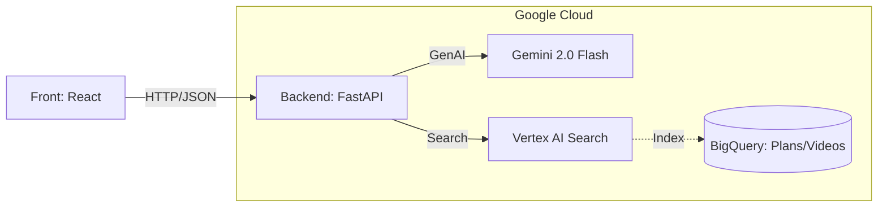

# バックエンド API 設計ドキュメント

## 目次
- [1. システム概要](#1-システム概要)
- [2. アーキテクチャ](#2-アーキテクチャ)
- [3. AI サービスの連携](#3-ai-サービスの連携)
- [4. API リファレンス](#4-api-リファレンス)
    - [4.1 旅行プラン作成 (Personal Mode)](#41-旅行プラン作成-personal-mode-apiv1plan)
    - [4.2 プラン検索 (Social Mode)](#42-プラン検索-social-mode-apiv1search)
- [4.3 メディア・フィードバック](#43-メディアフィードバック-apiv1media-apiv1report)
    - [4.4 認証 (Auth)](#44-認証-auth-apiv1auth)
    - [4.5 ユーザー (User)](#45-ユーザー-user-apiv1users)
- [5. セキュリティ & デプロイ](#5-セキュリティ--デプロイ)

---

## 1. システム概要

**AI Travel Experience Designer Backend** は、「Future Memories」アプリケーションを支える RESTful API サービスです。
本システムは、ユーザーの潜在的願望を形にする**「Personal Mode」**と、他者の良質な体験を再利用する**「Social Mode」**の2つの体験を提供します。

### 主要機能
1.  **Personal Mode (AI生成)**: ユーザー属性に基づき、Gemini がゼロから旅行プランを創造します。
2.  **Social Mode (検索・循環)**: Vertex AI Search を活用し、他者の実績プランや SNS 動画資産を検索・参照します。
3.  **Core Ecosystem (循環)**: ユーザーの体験レポートをフィードバックし、プランの評価や新規プランとしての還流を行います。

### 技術スタック
- **フレームワーク**: FastAPI (Python 3.12+)
- **データベース & 検索**: BigQuery / Vertex AI Search for Structured Data
- **AI プロバイダー**: Google Cloud Vertex AI / Gemini API (gemini-3-flash-preview 推奨)
- **デプロイ**: Google Cloud Run

---

## 2. アーキテクチャ



### データフロー
1.  **プラン生成**: フロントエンド -> API -> Gemini -> 3つのコンセプト提案
2.  **プラン検索**: フロントエンド -> API -> Vertex AI Search -> 適合する既存プランの返却
3.  **動画連携**: BigQuery (VideoAssets) に蓄積された SNS 動画のメタデータを参照し、プランに最適な「リアルな映像」を埋め込みます。

---

## 3. AI サービスの連携

### 3.1 Gemini (Generative AI)
- **役割**: 新規プランの創造、ユーザーの曖昧な要望の具体化、既存プランのブラッシュアップ (AI Concierge)、レポート内容の重複判定。
- **モデル**: `gemini-3-flash-preview` (高速かつマルチモーダル対応)

### 3.2 Vertex AI Search (Information Retrieval)
- **役割**: 蓄積された `Plans` および `VideoAssets` から、自然言語クエリや属性フィルターで最適な情報を検索。
- **検索対象**:
    - **Plans**: 過去の旅行プラン、口コミ、評価。
    - **VideoAssets**: 場所や雰囲気に紐づいた SNS 動画。

---

## 4. API リファレンス

### 4.1 旅行プラン作成 (Personal Mode) (`/api/v1/plan`)

#### 🏷️ **人気タグの取得 (Get Popular Tags)**
提案作成時に選択可能な人気のタグ一覧を取得します。

- **エンドポイント**: `GET /api/v1/plan/tags`
- **レスポンス**:
  ```json
  {
    "tags": [
      "歴史巡り",
      "グルメ",
      "絶景",
      ...
    ]
  }
  ```

#### 🛫 **提案の生成 (Generate Proposals)**
ユーザー属性(Mode)に基づき、3つの新規コンセプトを生成します。

- **エンドポイント**: `POST /api/v1/plan/proposals`
- **リクエスト**:
  ```json
  {
    "mode": "senior", // senior, family, solo, active, ladies
    "pref_locations": ["Kyoto"], // Optional
    "selected_tags": ["history", "quiet"], // Optional
    "custom_attributes": "Avoid stairs", // Optional
    "nights": 2, // Optional, default 1
    "departure_location": "Tokyo", // Optional
    "language": "ja"
  }
  ```
- **レスポンス**:
  ```json
  [
    {
      "id": 101,
      "title": "静寂の京都禅寺巡り",
      "tagline": "喧騒を離れ、心整うひとときを",
      "desc": "有名な観光地を避け、隠れた名刹を巡る...",
      "match": 95,
      "color": "from-slate-700 to-slate-500",
      "location": "Kyoto, Japan"
    }
    // ... total 3 items
  ]
  ```

#### 🗓️ **行程表の生成 (Generate Itinerary)**
選択された提案の詳細スケジュールを構築します。

- **エンドポイント**: `POST /api/v1/plan/itinerary`
- **リクエスト**:
  ```json
  {
    "proposalId": 101,
    "language": "ja"
  }
  ```
- **レスポンス**:
  ```json
  {
    "proposalId": 101,
    "schedule": [
      {
        "time": "10:00",
        "activity": "大徳寺で坐禅体験",
        "icon": "temple",
        "location": {"lat": 35.044, "lng": 135.746},
        "description": "初心者でも安心の指導付き..."
      }
    ],
    "souvenirs": [
      {
        "name": "京菓子",
        "price": "¥1,200"
      }
    ]
  }
  ```

---

### 4.2 プラン検索 (Social Mode) (`/api/v1/search`)

#### 🔍 **既存プランの検索 (Search Plans)**
Vertex AI Search を経由して、他者のプランを検索します。

- **エンドポイント**: `POST /api/v1/search/plans`
- **リクエスト**:
  ```json
  {
    "query": "京都 穴場 歴史",
    "filter": {
       "mode": "senior" // Optional
    },
    "limit": 10
  }
  ```
- **レスポンス**:
  ```json
  {
    "results": [
      {
         "plan_id": "uuid-...",
         "title": "早朝の清水寺と周辺散策",
         "description": "混雑する前に行くのがポイントです...",
         "match_reason": "「歴史」「穴場」のキーワードに一致",
         "thumbnail": "...",
         "tags": ["history", "morning"],
         "author": "UserA"
      }
    ]
  }
  ```

---

### 4.3 メディア・フィードバック (`/api/v1/media`, `/api/v1/report`)

#### 🎬 **メディア提案 (Get Media)**
(補完的API) 特定のキーワードや場所に関連する動画を検索します。

- **エンドポイント**: `POST /api/v1/media/search`

#### 📹 **動画生成 (Generate AI Video)**
Google Veo 3.1 Fast を使用して、ユーザーが旅行先にいる動画を生成します。

- **エンドポイント**: `POST /api/v1/media/video`
- **リクエスト**:
  ```json
  {
    "proposalId": 101,
    "title": "静寂の京都禅寺巡り",
    "description": "喧騒を離れ、心整うひとときを...",
    "user_profile_image_url": "gs://...",
    "user_id": 1
  }
  ```
- **レスポンス**:
  ```json
  {
    "video_url": "https://storage.googleapis.com/..."
  }
  ```

#### 📝 **レポート投稿 (Submit Report)**
旅行後の評価やレポートを送信します。AIが内容を評価し、新規プランとして登録するか既存への統合かを判定します。

- **エンドポイント**: `POST /api/v1/report`
- **リクエスト**:
  ```json
  {
    "plan_id": "uuid-...", // 元になったプランがあれば
    "comment": "最高でした！ただ、バスは混むのでタクシー推奨。",
    "rating": 5,
    "photos": []
  }
  ```
- **レスポンス**:
  ```json
  {
    "status": "success",
    "ai_analysis": "Existing plan updated with traffic tip." // 統合結果
  }
  ```

---

---

### 4.4 認証 (Auth) (`/api/v1/auth`)

#### 🔐 **ユーザー登録 (Register)**
新規ユーザーを登録します。

- **エンドポイント**: `POST /api/v1/auth/register`
- **リクエスト**:
  ```json
  {
    "username": "traveler01",
    "password": "securepassword",
    "age": 30,
    "gender": "male", // optional
    "address": "Tokyo, Japan" // optional
  }
  ```
- **レスポンス**:
  ```json
  {
    "user_id": 1,
    "username": "traveler01"
  }
  ```

#### 🔑 **ログイン (Login)**
ユーザー名とパスワードで認証し、アクセストークン(JWT)を発行します。

- **エンドポイント**: `POST /api/v1/auth/token`
- **リクエスト**: Content-Type: `application/x-www-form-urlencoded`
  - `username`: ユーザー名
  - `password`: パスワード
- **レスポンス**:
  ```json
  {
    "access_token": "ey...",
    "token_type": "bearer"
  }
  ```

---

### 4.5 ユーザー (User) (`/api/v1/users`)

#### 👤 **プロフィール取得 (Get Profile)**
現在ログインしているユーザーの情報を取得します。

- **エンドポイント**: `GET /api/v1/users/me`
- **ヘッダー**: `Authorization: Bearer <token>`
- **レスポンス**:
  ```json
  {
    "user_id": 1,
    "username": "traveler01",
    "profile_image_url": "https://storage.googleapis.com/...",
    "age": 30,
    "gender": "male",
    "address": "Tokyo, Japan"
  }
  ```

#### ✏️ **プロフィール更新 (Update Profile)**
ユーザー情報を更新します（アイコン画像含む）。

- **エンドポイント**: `PUT /api/v1/users/me`
- **ヘッダー**: `Authorization: Bearer <token>`
- **リクエスト**: Multipart/Form-Data (画像対応) または JSON
- **レスポンス**: 更新後のユーザー情報

#### 📂 **自分のプラン一覧 (Get My Plans)**
ユーザーが作成・保存したプラン履歴を取得します。

- **エンドポイント**: `GET /api/v1/users/me/plans`
- **ヘッダー**: `Authorization: Bearer <token>`

---

## 5. セキュリティ & デプロイ


- **CORS**: 開発環境(`localhost`), 本番環境ドメインからのアクセスを許可。
- **認証**: 将来的には Firebase Auth 等と連携し、`user_id` をヘッダーで検証。
